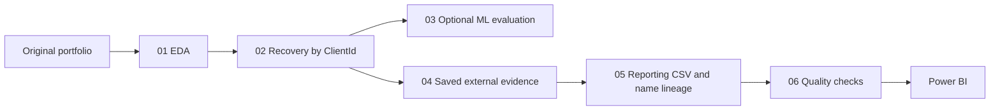

# Mexico P&C Portfolio: Industry Recovery and Premium Growth

[](https://github.com/joseror56i-maker/chubb-pc-portfolio-mexico/actions/workflows/quality-checks.yml)

A technical challenge solution for a Mexican Property & Casualty portfolio.
The submitted snapshot has **50,441 policies**, **8,565 clients** and **97.31% industry coverage**.
Its **1,356 unresolved policies remain in portfolio totals**.

The candidate's Databricks exports have been reviewed and organized into shared
Python processing modules, sequential notebooks and optional research. The core
runs in **Visual Studio Code or Databricks without third-party Python packages**.
Modeling and live enrichment have separate environments and execution controls.

## Deliverables and execution scope

| Deliverable | Status |
| --- | --- |
| Public GitHub repository | Reviewed processing, modeling and enrichment code included |
| Filled dataset | `data/processed/portfolio_reporting.csv`; supplied snapshot, byte-for-byte preserved |
| Quality report and short write-up | Reconciled to the snapshot; historical experiment scores identified |
| Local processing | End-to-end fixture run and unit tests pass with Python 3.12.14 |
| Databricks and original-data reproduction | Source prepared; requires original input, saved evidence and workspace execution |
| Interactive dashboard | Awaiting PBIX/PBIP and preview |

**The code ZIP did not include the original input or saved external mappings.**
Do not use the filled reporting CSV as raw data; it has already overwritten industry.
The refactored pipeline rejects that input. Historical ML scores and the 116
external fills have not been reproduced during packaging. Review changes to
evaluation and external acceptance mean a new run can differ from the snapshot.

## Results in the submitted snapshot

| Method | Policies | Confidence tier |
| --- | ---: | --- |
| `original` | 32,810 | `high` |
| `client_id` | 16,159 | `high` |
| `llm_external` | 116 | `medium_low` / `low` |
| `unresolved` | 1,356 | `unresolved` |
| **Total** | **50,441** | |

The flags imply 17,631 initially missing rows and 16,275 recovered rows (92.31%).
That reconciliation depends on the supplied provenance flags. Original-label
preservation still needs reconciliation against the original input.
See the [quality report](reports/fill_quality_report.md),
[short write-up](reports/technical_writeup.md) and [appendix](reports/technical_appendix.md).

## Project layout

```text
config/                 Data contract and portable pipeline example
data/raw/               Original input; excluded from Git by default
data/processed/          Unchanged submitted reporting snapshot
src/data_processing/    Recovery, evidence replay, name normalization, I/O, validation
src/modeling/           Reusable statistical diagnostic
src/enrichment/         Candidate prompt/schema and optional Databricks service adapter
src/pipeline.py         Local CLI using the same functions as notebooks
notebooks/01..06         Sequential Databricks source notebooks and final validation
notebooks/research/     Optional distributed EDA and live external research
tests/                  Identity, evidence, lineage, export and snapshot checks
reports/                Submission reports and verified snapshot diagnostics
docs/                   Runbook, code review, dictionary and submission checklist
dashboard/              Dashboard packaging and refresh guidance
assets/                 Place for an actual dashboard preview
work/runs/              Generated run artifacts; excluded from Git
```

## Processing sequence



ML is a feasibility experiment; its predictions never enter the fill pipeline.
External replay makes no model/web calls. Without a reviewed cache, residual
clients remain `Unresolved`. Optional live research is a separate notebook.

## Quick start: Visual Studio Code / Python

Open the complete repository folder and select Python 3.12. From its root:

```powershell
python -m unittest discover -s tests -v
python src/data_processing/validate_portfolio.py --verify-snapshot
```

These work immediately on the included files. To run recovery after obtaining the
original input, put it at `data/raw/portfolio_original.csv`, then:

```powershell
Copy-Item config/pipeline.example.json config/pipeline.local.json
python -m src.pipeline --config config/pipeline.local.json
```

Edit the private config as needed; relative paths are resolved against its own
directory. Use a fresh `output_dir` for each run. Output includes stage CSVs,
aggregate diagnostics, external audit, name lineage, final validation and an
artifact fingerprint manifest. The submitted snapshot is protected from overwrite.

## Databricks

Clone into a Git folder. Create the same private config with either `input_path`
for a Volume CSV or `input_table` for the original Spark table. Use a writable
Unity Catalog Volume as `output_dir`. Run notebooks **01 → 02 → optional 03 → 04 → 05 → 06**.
The core collects at most **100,000 rows** on the driver; it targets this 50k-policy
challenge. Larger portfolios need a distributed implementation of these rules.

Modeling uses optional pins in `requirements-modeling.txt`. Local Spark research
also needs `requirements-spark-local.txt` and Java 17+. These are proposed research
pins, not a recovered original environment lock. Live `ai_enrich` needs compatible
workspace capabilities and explicit enablement; see the [runbook](docs/runbook.md).

## Decisions and limitations

- Identity is `ClientId`. In the snapshot, 2,310 exact names are shared across
  client IDs. Names are for display and never merge separate clients.
- Conflicting original industries stop recovery; one mapping per client prevents
  join multiplication. Original fields survive intermediate exports.
- Reviewed external replay uses the same rule as backtesting: high/high declared
  confidence, official verification, source metadata, valid taxonomy and no error.
  Accepted candidates remain `medium_low`. This is stricter than historical fills.
- The historical external backtest had zero correct labels among four accepted
  candidates out of 45 evaluated clients. It does not establish external accuracy.
- Confidence tiers describe provenance, not calibrated probabilities. Same-client
  leave-one-out assesses internal recoverability, not unseen-client performance.
- Currency is unspecified; **MXN is the candidate's assumption**. No USD conversion
  is established. One client represents 18.41% of premium; keep official totals and
  show a clearly labeled concentration sensitivity if useful.
- Proposed written-premium timing uses policy start date (2021–2024). Actual DAX,
  same-period growth and dashboard refresh remain to be reviewed.

The CSV was renamed from `Client_Name_Normalization_Reporting_FINAL_v2.csv` without
changing bytes. Its hash is in `config/portfolio_contract.json`. This is a candidate
submission, not an official Chubb product; no code/data license has been assumed.

See [code review and corrections](docs/review_notes.md),
[source mapping](docs/source_inventory.md), [execution instructions](docs/runbook.md)
and the [remaining submission checklist](docs/submission_checklist.md).
